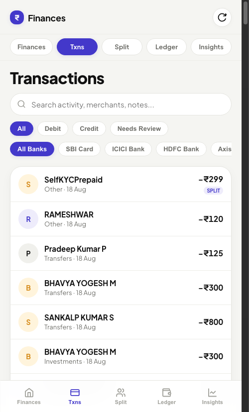
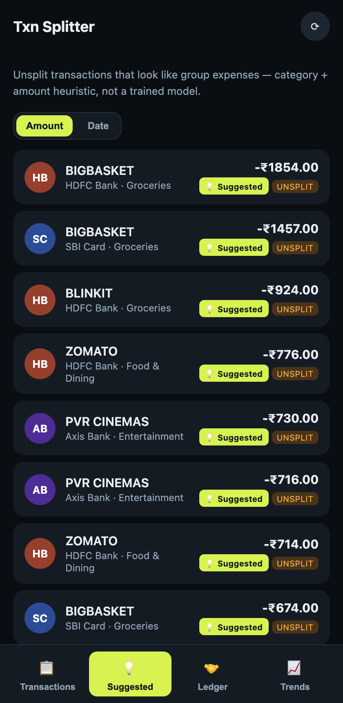
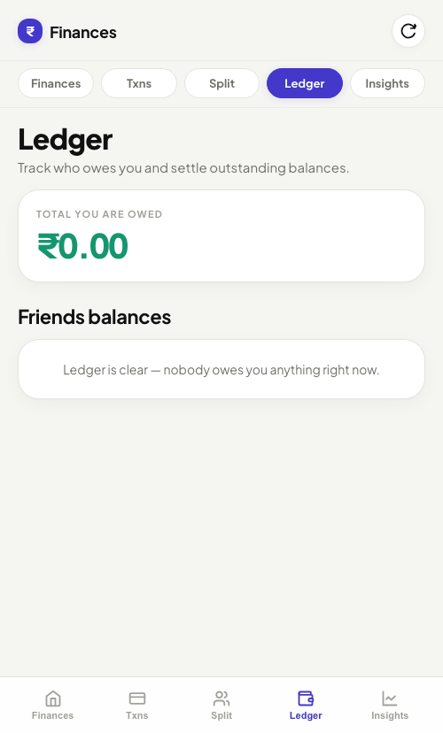
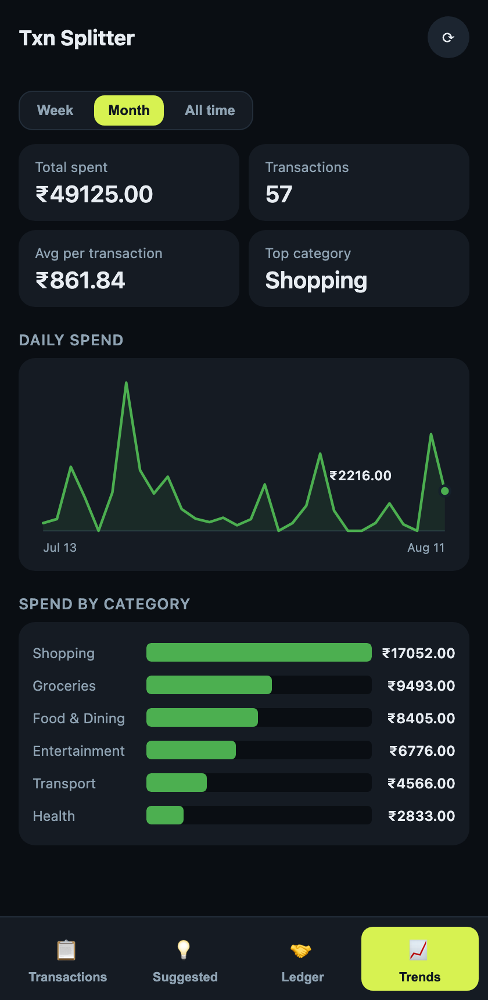

# gmail-txn-parser

**Branch: `gmail-sms-shortcut`** — cloud-deployable, no Mac required:
email parsing via Gmail's API plus SMS-only bank alerts pushed from an
iOS Shortcuts automation. See [Branching](#branching) for the other
branches.

A personal tool that watches your Gmail (and, optionally, SMS-only bank
alerts from your iPhone) for transaction notifications, parses them into
structured data, categorizes spend, and gives you a phone-installable
PWA to split expenses with friends — a self-hosted mini-Splitwise
triggered by your own real spending instead of manual entry.

No multi-user auth, no third-party analytics, no hosted service — your
financial data never leaves wherever you run this, except for the calls
you explicitly wire up (Gmail's own API to read your own inbox, and an
LLM call only for the rare message a regex can't parse).

## What it does

- **Parses real bank emails & SMS alerts** into structured transactions — amount,
  merchant, date, bank, category — via deterministic regex per bank
  template, not an LLM by default. Supports IndusInd, SBI Card, ICICI
  (debit-card purchase, account credit, SMS alerts), HDFC (credit card + UPI
  templates), OneCard, and Axis Bank out of the box; adding your own bank is
  straightforward (see `LIVE_SETUP.md`).
- **Multi-Source Reconciliation & Anti-Deduplication**: Separates incoming source
  messages (`sourceMessages`) from canonical transactions (`transactions`). Automatically
  reconciles cross-channel alerts (e.g. an SMS and email for the same payment)
  using a 4-level matching hierarchy (refNo exact match, tight deterministic window,
  weighted similarity score, and LLM arbitration for ambiguous cases). Same-channel
  alerts are guarded against accidental merging.
- **Fast Pre-filtering**: Drops non-transactional noise (OTPs, bill-ready alerts,
  login notifications) before parsing or calling any external APIs.
- **Never silently loses a transaction**: A message from a known sender
  whose exact template doesn't match falls back to an LLM extraction; if
  that also fails, it's stored flagged for review with raw text intact and
  retried automatically on subsequent fetches.
- **Pipeline Stats & Unmatched Template Tracking**: Logs counters (processed,
  filtered, regex, LLM fallback, review) and tracks unparsed message signatures
  (`node cli.js unmatched-templates`) so recurring formats can easily be converted into regexes.
- **Categorizes spend** with an editable, deterministic keyword matcher — no LLM call needed.
- **Splits and settles** expenses with friends — even split or custom per-friend amounts — tracks a running ledger.
- **Phone-installable PWA**: Day-wise transaction list, spend trend charts, a "possibly shareable" suggestion tab, and ledger view. Reachable via [Tailscale](https://tailscale.com).

## Screenshots

<p float="left">
  
  
  
  
</p>

*(shown with synthetic demo data, not real transactions)*

## Quick start

```
npm install
npm test                     # bank email parser fixtures, real excerpts, no network needed
npm run test:sms             # SMS parser fixtures
npm run test:matching        # matching engine & similarity score test suite
npm run test:nontransaction  # OTP & non-transactional filter test suite
npm run test:pipeline-stats  # pipeline statistics & template signature tracking tests
npm run test:dedup           # multi-source reconciliation integration tests
npm run test:split           # split/ledger/dedupe logic, isolated from real data
```

Then walk through **[`LIVE_SETUP.md`](LIVE_SETUP.md)** for the real
setup: your own Google Cloud OAuth credentials, a free OpenRouter API key,
the iOS Shortcut for SMS ingestion, background scheduling, and phone
access via Tailscale.

## Architecture

```
bankParsers.js              regex extraction per bank email sender, pure functions, no I/O
smsParsers.js                 regex extraction per bank SMS sender, pure functions, no I/O
bankSourceConfig.js           declares expected alert channels (email, SMS, or both) per bank
nonTransactional.js           pre-filter for OTPs, app activation alerts, and non-transaction noise
matchingEngine.js             4-level source reconciliation hierarchy (refNo, tight window, weighted score, LLM)
merchantNormalize.js          merchant text normalization & string similarity scoring
pipelineStats.js              pipeline instrumentation counters & redacted unmatched-template log
categorize.js                deterministic merchant -> category keyword matcher
llmFallback.js                OpenRouter API call for unmatched templates or ambiguous reconciliation
db.js                         flat-JSON local store: transactions, sourceMessages, friends, splits, ledger
auth.js                        Google OAuth2 loopback flow for Gmail API access
fetchAndParse.js               Gmail -> bankParsers -> db.js
fetch-all.sh                     thin wrapper around fetchAndParse.js, used by scheduler + PWA refresh
cli.js                           review/split/settle + pipeline stats (`unmatched-templates`, `stats`)
server.js                     PWA backend: REST API + health check (/api/health) + POST /api/sms-ingest
migrate-source-messages.js    idempotent migration utility to upgrade pre-existing transactions to multi-source schema
public/                        PWA frontend (vanilla JS, no build step, no framework)
OPERATIONS.md                 ops runbook: health checks, PM2 process management, backups, VM deploys
```

No build step, no bundler, no frontend framework, no ORM. Flat JSON file
for storage — deliberately, to avoid a native-compile dependency (see
`CLAUDE.md` for the full list of design decisions and why, plus a
section on deploying to a cloud VM).

## Design philosophy

- **Sender allowlist, not keyword blocklist.** Only mail/SMS from a
  sender you've explicitly told it to look for is ever parsed — promo,
  tax-refund, and payment-failed noise disappears without extra filter
  logic. A new bank is invisible until added — deliberate, not a bug.
- **Never guess silently.** A parsed field is only ever the direct
  output of a regex match or an LLM extraction against real message
  text — never inferred from a partial pattern with no real basis.
- **Real fixtures only.** Every parser in this repo, for every bank, was
  built from an actual message and ships with that real text as a test
  fixture — never an invented/guessed template.

## Branching

- `main` — full version, includes SMS parsing for SMS-only banks via a
  Mac's local Messages database (`chat.db`). Requires a Mac kept awake
  with Full Disk Access granted.
- `gmail-only` — email-only, no Mac/SMS dependency, deployable anywhere
  Node runs. Loses SMS-only banks entirely in exchange for a simpler
  deployment story.
- `gmail-sms-shortcut` (this branch) — `gmail-only`'s cloud-deployable
  base plus SMS-only bank alerts, sourced from an iOS Shortcuts
  automation pushing to `POST /api/sms-ingest` instead of a Mac's
  `chat.db`. Gets SMS coverage *and* stays Mac-independent.

## Forking this for yourself

This is a personal project meant to be adapted, not a hosted service.
Your bank's email/SMS templates are almost certainly different from the
ones already parsed here — treat the existing parsers as a reference
implementation and add your own the same way each one here was built
(see `LIVE_SETUP.md`). Real financial data and live credentials
(`db.json`, `token.json`, `credentials.json`) are gitignored and should
never be committed — check `.gitignore` before pushing your own fork.

## License

MIT.
